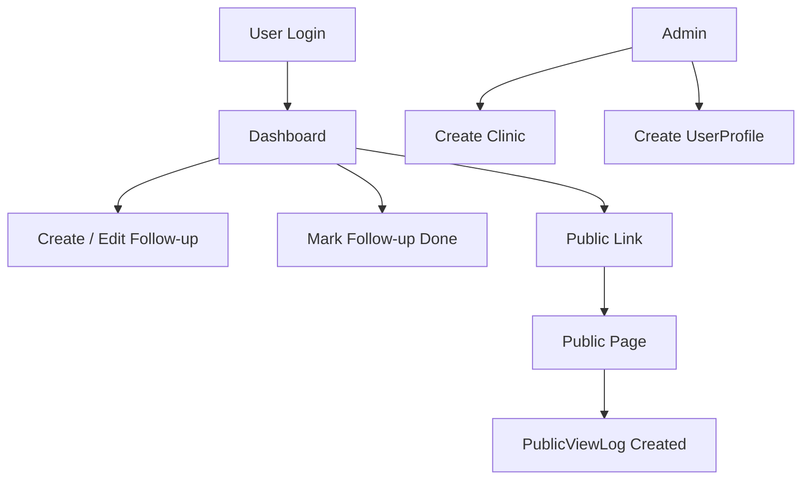
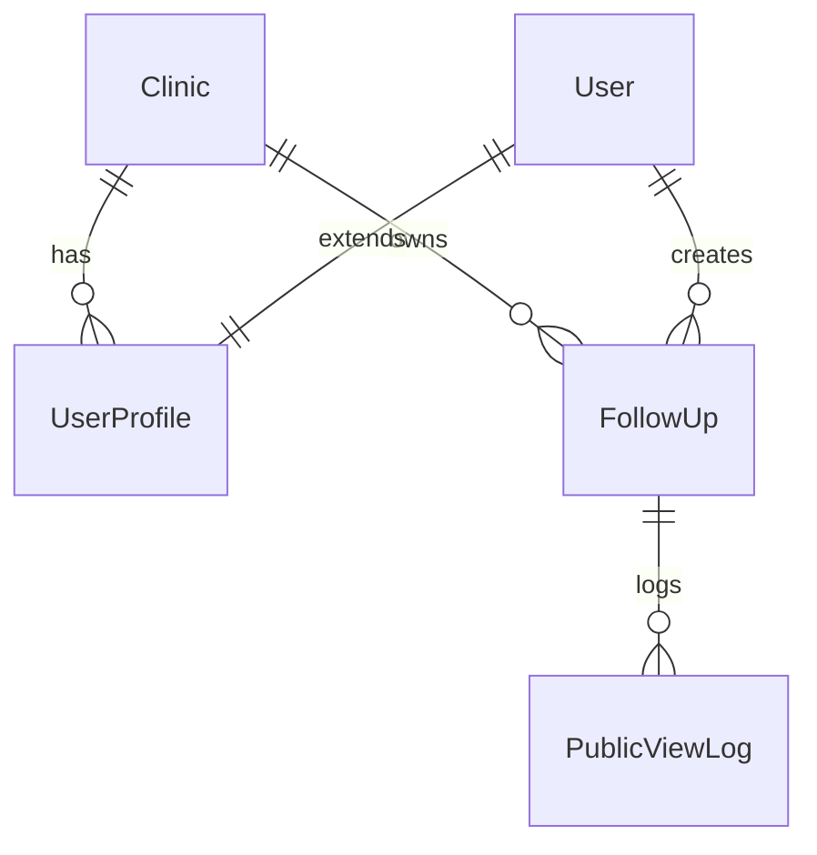

# 🏥 Clinic Follow-up Tracker (Lite)

A lightweight Django application to manage clinic follow-ups with secure access control, public follow-up links, CSV import, and audit logging.

This project demonstrates **production-ready Django fundamentals** including ORM modeling, authentication, authorization, admin customization, management commands, and testing.

---

## 🚀 Features

* Multi-clinic architecture with strict data isolation
* Follow-up tracking with status, due dates, and language support
* Secure public follow-up pages via unique tokens
* View logging for public access
* CSV import using a pure Python management command
* Django Admin support
* MySQL via Docker
* Clean separation of concerns

---

## 🛠 Tech Stack

* Python 3.10+
* Django 5.x
* MySQL (Dockerized)
* Django Templates (no external UI frameworks)

---

## 📁 Project Structure

```
clinic-followup-tracker/
├── config/                # Project settings & URLs
├── followups/             # Core application
│   ├── management/
│   │   └── commands/
│   │       └── import_followups.py
│   ├── models.py
│   ├── views.py
│   ├── forms.py
│   ├── admin.py
│   └── tests.py
├── templates/
│   ├── followups/
│   └── registration/
├── docker-compose.yaml
├── sample.csv
├── requirements.txt
├── manage.py
└── README.md
```

---

## ⚙️ Setup Instructions

### 1️⃣ Clone the Repository

```bash
git clone https://github.com/sidhyaashu/clinic_followup_tracker.git
cd clinic_followup_tracker
```

---

### 2️⃣ Create Virtual Environment

```bash
python -m venv .venv
source .venv/bin/activate      # Linux / Mac
.venv\Scripts\activate         # Windows
```

---

### 3️⃣ Install Dependencies

```bash
pip install -r requirements.txt
```

---

### 4️⃣ Start MySQL with Docker

```bash
docker-compose up -d
```

Ensure `.env` contains correct DB credentials.

---

### 5️⃣ Run Migrations

```bash
python manage.py migrate
```

---

### 6️⃣ Create Superuser

```bash
python manage.py createsuperuser
```

This user will be used to access the Django Admin.

---

## 👤 Creating Clinic and UserProfile

### Step 1: Login to Admin

```
http://127.0.0.1:8000/admin/
```

---

### Step 2: Create a Clinic

* Navigate to **Clinics**
* Click **Add Clinic**
* Enter name
* `clinic_code` is auto-generated

---

### Step 3: Create a UserProfile

* Navigate to **User Profiles**
* Select a Django User
* Assign the Clinic

> ⚠️ Every user **must** have a UserProfile to access the dashboard.

---

## ▶️ Running the Application

```bash
python manage.py runserver
```

Access:

* Login: `http://127.0.0.1:8000/login/`
* Dashboard: `http://127.0.0.1:8000/`

---

## 📊 Dashboard Capabilities

* View all follow-ups for your clinic
* Filter by:

  * Status (pending / done)
  * Due date range
* See summary counts:

  * Total
  * Pending
  * Done
* Public link per follow-up
* View count per follow-up

---

## 🌍 Public Follow-up Page

```
/p/<public_token>/
```

* No login required
* Language-based instructions (English / Hindi)
* Every visit creates a `PublicViewLog`

---

## 📥 CSV Import (Pure Python)

### Sample CSV

`sample.csv` is included in the root directory.

---

### Command

```bash
python manage.py import_followups --csv sample.csv --username <username>
```

### Behavior

* Valid rows → created
* Invalid rows → skipped
* Import continues safely
* Summary printed at the end

Example output:

```text
Import completed: 2 created, 2 skipped
```

---

## 🧪 Running Tests

> ⚠️ Ensure your MySQL test user has permission to create test databases.

```bash
python manage.py test
```

### Tests Included

* Unique `clinic_code` generation
* Unique `public_token` generation
* Dashboard requires login
* Cross-clinic access is blocked
* Public page creates `PublicViewLog`

---

## 🔐 Authorization Rules

* Users can only access follow-ups belonging to their clinic
* All dashboard and CRUD views require login
* Public pages are read-only and token-based

---

## 🔁 User Flow Diagram



---

## 🧠 Data Model Relationships



---

## ✅ Assignment Coverage Checklist

| Requirement                    | Status |
| ------------------------------ | ------ |
| Project setup                  | ✅      |
| Django ORM models              | ✅      |
| Admin customization            | ✅      |
| Authentication & authorization | ✅      |
| Dashboard + public page        | ✅      |
| CSV import command             | ✅      |
| View logging                   | ✅      |
| Tests                          | ✅      |
| MySQL via Docker               | ✅      |

---

## 📌 Notes

* Auto-generated fields are enforced at the DB level
* No DRF or external UI frameworks used
* Focused on correctness, clarity, and core functionality

---

## 📽 Proof of Functionality

* Screen recording OR
* Screenshots:

  * Dashboard
  * Create/Edit follow-up
  * Public page
  * View log in admin

---

### 👨‍💻 Author

**Asutosh Sidhya**