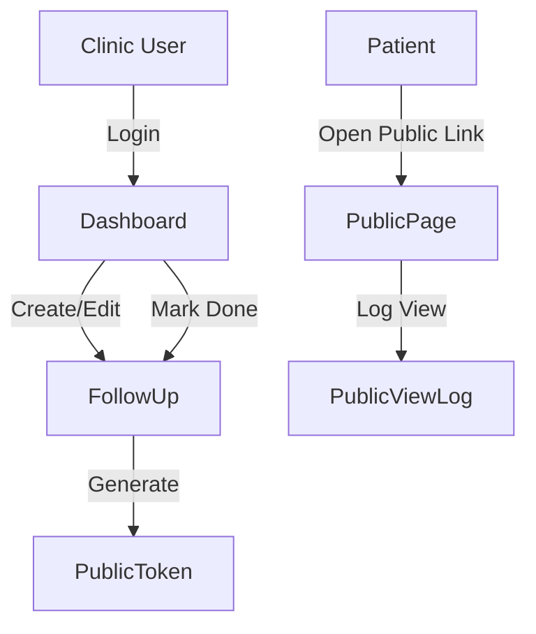
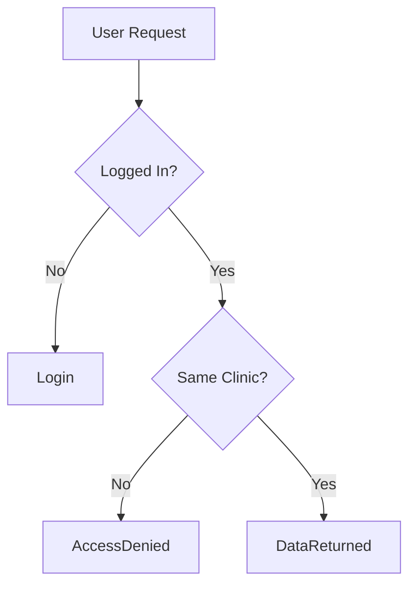
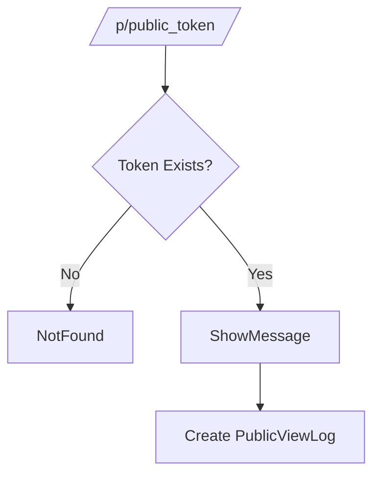
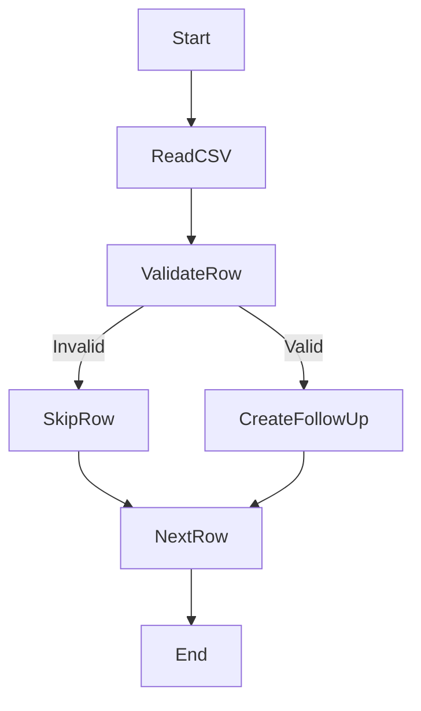

```mermaid
flowchart TD
    User[Clinic User] -->|Login| Dashboard
    Dashboard -->|Create/Edit| FollowUp
    Dashboard -->|Mark Done| FollowUp
    FollowUp -->|Generate| PublicToken

    Patient[Patient] -->|Open Public Link| PublicPage
    PublicPage -->|Log View| PublicViewLog

```

```mermaid
flowchart TD
    Request[User Request] --> AuthCheck{Logged In?}
    AuthCheck -- No --> Login
    AuthCheck -- Yes --> ClinicCheck{Same Clinic?}
    ClinicCheck -- No --> AccessDenied
    ClinicCheck -- Yes --> DataReturned
```

```mermaid
flowchart TD
    PublicURL[/p/public_token/] --> TokenValid{Token Exists?}
    TokenValid -- No --> NotFound
    TokenValid -- Yes --> ShowMessage
    ShowMessage --> CreateLog[Create PublicViewLog]

```

```mermaid
flowchart TD
    Start --> ReadCSV
    ReadCSV --> ValidateRow
    ValidateRow -- Invalid --> SkipRow
    ValidateRow -- Valid --> CreateFollowUp
    SkipRow --> NextRow
    CreateFollowUp --> NextRow
    NextRow --> End
```